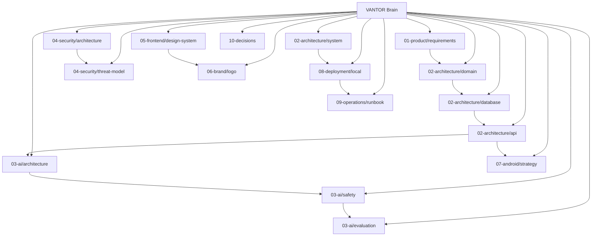

<!-- vantor-brain-link -->
> You are in the 🧠 **VANTOR Brain** — mirror index: [Docs index](README.md).

# 🧠 VANTOR Brain — central knowledge index

> **Start here.** Every document in this repo links back here, and this brain links to every document. No orphan pages.
> Mirror index: [`docs/README.md`](README.md) · Root: [`../README.md`](../README.md) · Roadmap: [`00-plan/ROADMAP.md`](00-plan/ROADMAP.md)

## How to read VANTOR in 5 minutes

1. Vision + status → [`../README.md`](../README.md)
2. What we found → [`00-plan/REPOSITORY_AUDIT.md`](00-plan/REPOSITORY_AUDIT.md) (VERIFIED 2026-09-26: 5/5 repos, ~775 files)
3. How 5 repos become 1 → [`00-plan/MIGRATION_PLAN.md`](00-plan/MIGRATION_PLAN.md)
4. Build order → [`00-plan/ROADMAP.md`](00-plan/ROADMAP.md)
5. Shared language → [`glossary.md`](glossary.md)

## Knowledge graph

## Every document (bidirectional — each links back here)

| # | Document | Answers | Status |
|---|---|---|---|
| 0 | [`../README.md`](../README.md) | What is VANTOR, quickstart, layout | PLANNED scaffold |
| 0 | [`00-plan/ROADMAP.md`](00-plan/ROADMAP.md) | Phases 0–10, Definition of Done | PLANNED |
| 0 | [`00-plan/REPOSITORY_AUDIT.md`](00-plan/REPOSITORY_AUDIT.md) | 5-repo audit matrix | VERIFIED |
| 0 | [`00-plan/MIGRATION_PLAN.md`](00-plan/MIGRATION_PLAN.md) | KEEP/ADAPT/MERGE/… plan | PLANNED |
| 1 | [`01-product/requirements.md`](01-product/requirements.md) | PRD: modules, graph, non-negotiables | PLANNED |
| 2 | [`02-architecture/system.md`](02-architecture/system.md) | Modular monolith, free topology | PLANNED |
| 2 | [`02-architecture/domain.md`](02-architecture/domain.md) | 60-entity domain model | PLANNED |
| 2 | [`02-architecture/database.md`](02-architecture/database.md) | Postgres+pgvector, RLS | PLANNED |
| 2 | [`02-architecture/api.md`](02-architecture/api.md) + [`../api/openapi.yaml`](../api/openapi.yaml) | REST contract, typed AI tools | PLANNED |
| 3 | [`03-ai/architecture.md`](03-ai/architecture.md) | Gateway, evidence, HITL, pipeline | PLANNED |
| 3 | [`03-ai/safety.md`](03-ai/safety.md) | Injection defense | PLANNED |
| 3 | [`03-ai/evaluation.md`](03-ai/evaluation.md) | Eval gates | PLANNED |
| 4 | [`04-security/architecture.md`](04-security/architecture.md) | OIDC/RBAC/RLS/audit | PLANNED |
| 4 | [`04-security/threat-model.md`](04-security/threat-model.md) | STRIDE threats | PLANNED |
| 5 | [`05-frontend/design-system.md`](05-frontend/design-system.md) | Tokens + components | PLANNED |
| 6 | [`06-brand/logo.md`](06-brand/logo.md) + [`../assets/brand/`](../assets/brand/) | Vantor identity | IMPLEMENTED art |
| 7 | [`07-android/strategy.md`](07-android/strategy.md) | Kotlin/Compose plan | PLANNED |
| 8 | [`08-deployment/local.md`](08-deployment/local.md) + [`../docker-compose.yml`](../docker-compose.yml) | Free local stack | IMPLEMENTED compose |
| 9 | [`09-operations/runbook.md`](09-operations/runbook.md) | Health/backup/incidents | PLANNED |
| 10 | [`10-decisions/README.md`](10-decisions/README.md) | ADR index (001–006) | Accepted |
| X | [`glossary.md`](glossary.md) | Ubiquitous language | IMPLEMENTED |

## Concept trails (follow the brain, not folders)

- **New developer:** Brain → glossary → system → database → api → local → runbook.
- **New auditor:** Brain → threat-model → security/architecture → audit events (domain) → runbook incidents.
- **New AI engineer:** Brain → ai/architecture → safety → evaluation → api (tools) → domain (AIEvidence).
- **New designer:** Brain → brand/logo → design-system → android/strategy.
- **New DevOps:** Brain → system → local → runbook → decisions/ADR-001,002,005.

## Brain maintenance rule

Any new `.md` added anywhere MUST: (1) add a row above, (2) prepend the standard breadcrumb header (verified by `python scripts/verify_brain_links.py`), (3) appear in `docs/README.md` + `mkdocs.yml` nav. CI docs gate enforces this.
